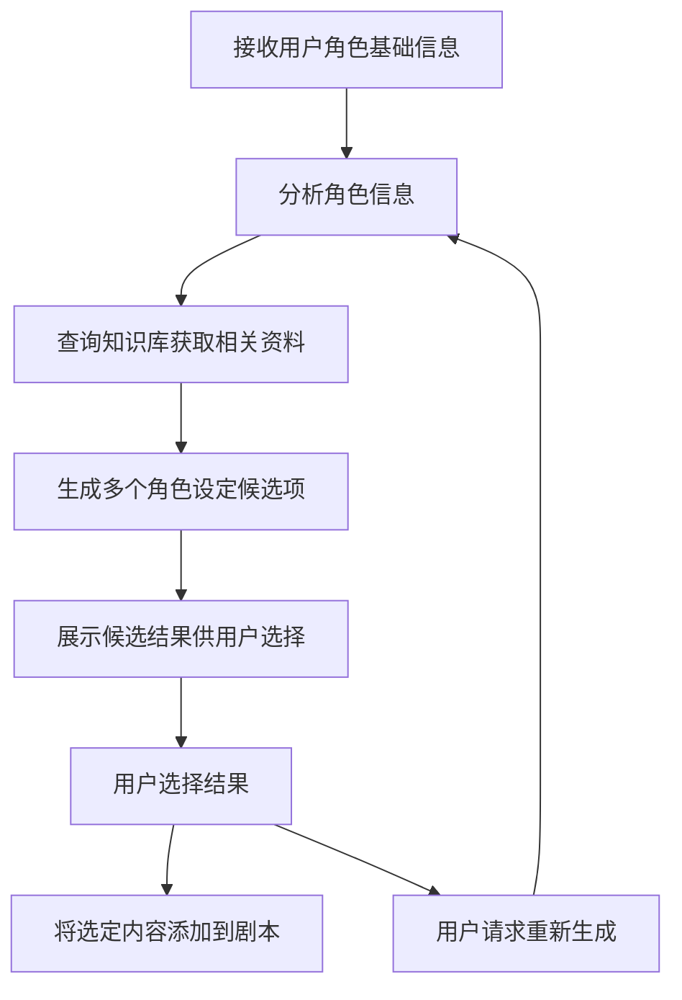

# 剧本角色设定补全功能

## 流程结构



## 各步骤职责说明

### 1. 接收用户角色基础信息
- **职责**：接收并解析用户提供的角色基础信息（如姓名、年龄、基本背景等）
- **输入**：用户在表单或文本框中输入的角色初步信息
- **输出**：结构化的角色基础信息对象
- **实现要点**：对用户输入进行结构化，识别关键信息（姓名、年龄、职业等）

### 2. 分析角色信息
- **职责**：分析用户提供的信息，确定需要补充的部分
- **输入**：结构化的角色基础信息
- **输出**：分析报告，包含已知信息与待补充信息
- **实现要点**：使用预设规则判断哪些角色信息缺失或需要丰富

### 3. 查询知识库获取相关资料
- **职责**：基于已有信息查询相关知识，丰富角色背景
- **输入**：角色基础信息、分析报告
- **输出**：与角色相关的背景知识、类似角色参考
- **实现要点**：使用RAG技术从知识库检索相关信息

### 4. 生成多个角色设定候选项
- **职责**：基于分析结果和检索的知识，生成2-3个不同风格的角色设定
- **输入**：角色基础信息、分析报告、检索的知识
- **输出**：2-3个完整的角色设定候选项
- **实现要点**：通过不同侧重点生成差异化候选项

### 5. 展示候选结果供用户选择
- **职责**：以比较形式展示生成的候选项
- **输入**：角色设定候选项
- **输出**：用户界面显示
- **实现要点**：清晰展示不同候选项的差异，突出各自特点

### 6. 用户选择结果
- **职责**：处理用户的选择
- **输入**：用户选择
- **输出**：最终选定的角色设定
- **实现要点**：支持直接选择、混合选择或请求重新生成

### 7. 将选定内容添加到剧本
- **职责**：将最终角色设定整合到剧本中
- **输入**：选定的角色设定
- **输出**：更新后的剧本
- **实现要点**：维护角色设定与其他部分（如剧情、关系网络）的一致性

## Prompt模板

### 基础信息分析Prompt
```
我需要分析以下角色的基础信息，并判断哪些方面需要补充：

角色名称: {{characterName}}
已知信息: {{knownInformation}}

请分析这个角色的以下方面是否已经明确：
1. 基本信息（年龄、性别、职业）
2. 外貌特征
3. 性格特点
4. 成长背景
5. 目标和动机
6. 能力和特长
7. 弱点和缺陷
8. 与其他角色的关系

对于每个缺失的方面，请提供一个标记，我将用这些标记来指导后续生成。
```

### 候选结果生成Prompt
```
请为剧本角色"{{characterName}}"生成{{candidateCount}}个不同风格的完整角色设定。已知的信息如下：

{{knownInformation}}

基于分析，需要补充的方面包括：{{missingAspects}}

从知识库中获取的相关参考信息：
{{retrievedContext}}

请生成{{candidateCount}}个差异化的角色设定，确保它们符合以下条件：
1. 保持与已知信息一致
2. 补充所有缺失的方面
3. 每个候选项应有不同的风格或侧重点
4. 候选项1应更加{{style1}}
5. 候选项2应更加{{style2}}
{{#if thirdCandidate}}
6. 候选项3应更加{{style3}}
{{/if}}

为每个候选项提供一个简短标题，概括其特点。
```

### 候选项合并Prompt
```
用户选择了以下几个候选角色设定中的部分内容，请将它们融合为一个连贯一致的完整角色设定：

原始基础信息：
{{knownInformation}}

从候选项1中选择的内容：
{{selection1}}

从候选项2中选择的内容：
{{selection2}}

{{#if selection3}}
从候选项3中选择的内容：
{{selection3}}
{{/if}}

请生成一个连贯、一致、自然的角色设定，无缝融合上述内容，并确保角色特点和动机具有内在逻辑性。
```

## 可选RAG接入点

### 1. 角色类型与原型识别
- **目的**：识别用户描述的角色属于哪种类型或原型
- **查询示例**：`{{characterName}} 职业 {{profession}} 类型 原型 典型特征`
- **接入时机**：分析角色信息阶段
- **作用**：提供角色类型的典型特征，帮助生成符合类型的设定

### 2. 特定背景知识检索
- **目的**：获取与角色职业、身份或时代背景相关的专业知识
- **查询示例**：`{{profession}} 专业知识 日常工作 行业术语`或`{{era}} {{location}} 历史背景 社会环境`
- **接入时机**：生成候选设定前
- **作用**：增加角色设定的专业性和真实感

### 3. 角色关系模式检索
- **目的**：获取不同关系类型的典型互动模式
- **查询示例**：`{{relationshipType}} 关系模式 互动特点 典型冲突`
- **接入时机**：补充角色关系时
- **作用**：丰富角色间的互动可能性，增加关系的复杂性

### 4. 性格特质关联检索
- **目的**：获取某种性格特质的典型表现和相关特征
- **查询示例**：`{{personalityTrait}} 行为表现 言语特征 决策倾向`
- **接入时机**：设定角色性格时
- **作用**：让角色性格更加立体，表现更加一致

### 5. 剧本内容一致性检查
- **目的**：确保新生成的角色设定与剧本现有内容保持一致
- **查询示例**：`剧本 {{scriptTitle}} 世界观 设定 角色 {{relatedCharacters}}`
- **接入时机**：最终生成前
- **作用**：避免角色设定与剧本其他部分产生冲突

## 实现注意事项

1. **差异化策略**：为候选项设计不同的生成侧重点，如：
   - 候选项1：偏向心理描写和内心成长
   - 候选项2：偏向社会关系和外部冲突
   - 候选项3：偏向独特能力和专业背景

2. **评分机制**：可以实现一个评分系统，对生成的候选项进行质量评估，包括：
   - 完整性：是否涵盖所有必要方面
   - 一致性：内部逻辑是否自洽
   - 独特性：是否有鲜明特点
   - 适配性：是否与剧本风格契合

3. **用户反馈整合**：设计机制记录用户选择偏好，不断优化生成策略

4. **知识库构建建议**：
   - 收集不同类型剧本中的经典角色设定
   - 整理不同职业、身份的专业知识
   - 收录不同时代背景的社会环境资料
   - 总结不同性格类型的典型特征 